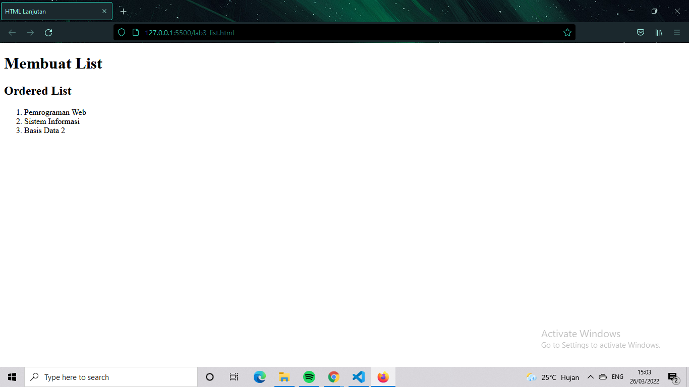
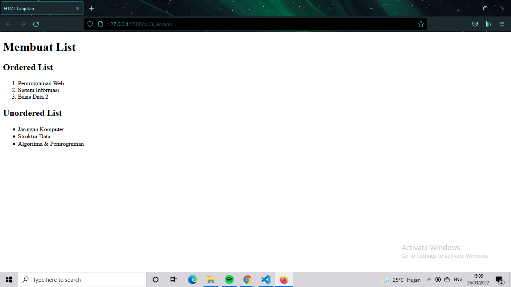
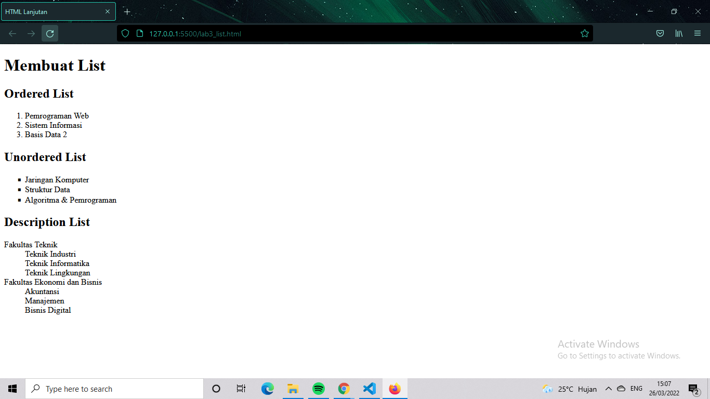
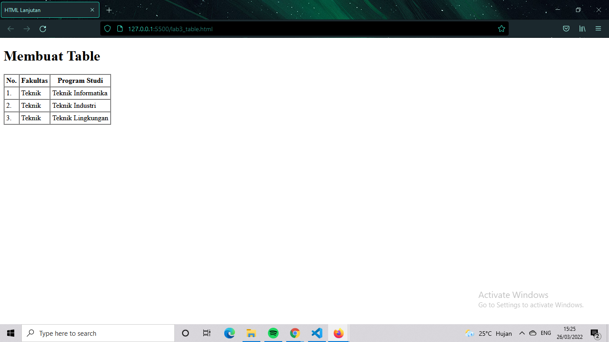
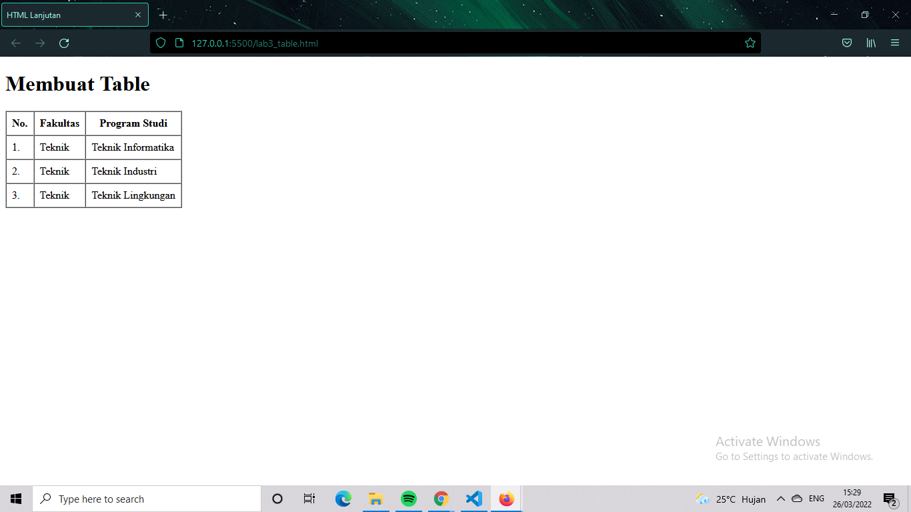
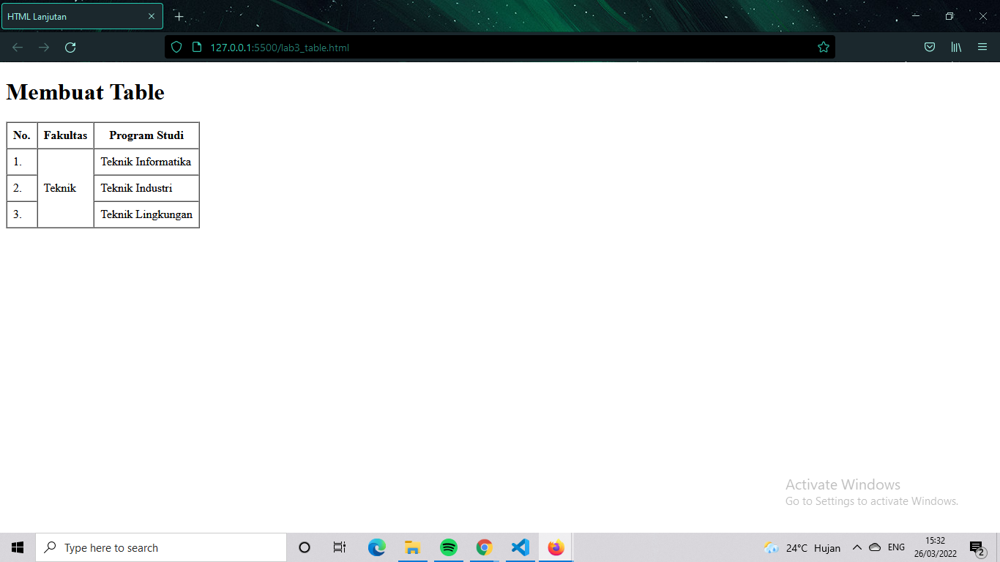
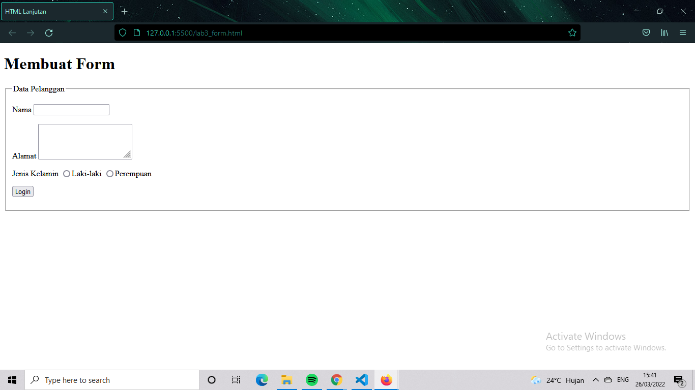
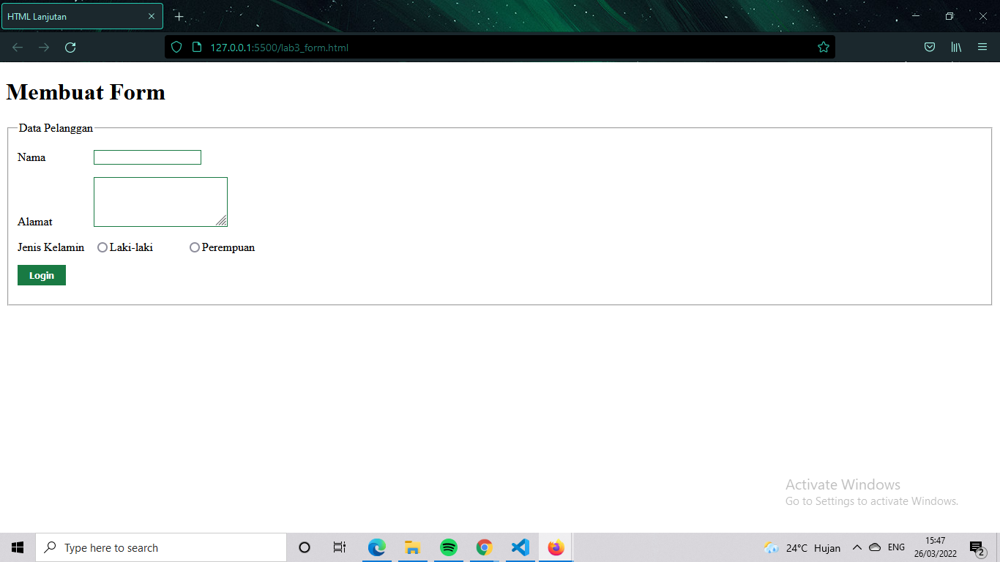

| Reza Tariki taser     | 312010265         |
| --------------------- | ----------------  |
|PEMROGRAMAN WEB        | PRAKTIKUM         |

## 1) MEMBUAT ORDER LIST


order list adalah list yang  tersusun dan terurut
```html
    <header>
        <h1>Membuat List</h1>
    </header>
    <section id="order-list">
        <h2>Ordered List</h2>
        <ol>
        <li>Pemrograman Web</li>
        <li>Sistem Informasi</li>
        <li>Basis Data 2</li>
        </ol>
        </section>
```

## 2). MEMBUAT UNORDERED LIST


unordered list adalah list yang tidak terurut atau tersusun
```html
<section id="unorder-list">
            <h2>Unordered List</h2>
            <ul type="square">
            <li>Jaringan Komputer</li>
            <li>Struktur Data</li>
            <li>Algoritma &amp; Pemrograman</li>
            </ul>
            </section>
```

## 3). MEMBUAT DESCRIPTION LIST


Description list adalah list yang didalam nya terdapat dt sebagai sebuah istilah konten sedangkan penjelasannya yaitu dd
```html
<section id="unorder-list">
                <h2>Description List</h2>
                <dl>
                <dt>Fakultas Teknik</dt>
                <dd>Teknik Industri</dd>
                <dd>Teknik Informatika</dd>
                <dd>Teknik Lingkungan</dd>
                <dt>Fakultas Ekonomi dan Bisnis</dt>
                <dd>Akuntansi</dd>
                <dd>Manajemen</dd>
                <dd>Bisnis Digital</dd>
                </dl>
                </section>
```

## 4).MEMBUAT TABLE


dalam membuat table diperlukan tag table kemudian tag thead dan th untuk table head dan tbody dan td untuk table data dan tr sendiri adalah table row.
```html
<header>
        <h1>Membuat Table</h1>
    </header>
    <table border="1" cellpadding="4" cellspacing="0">
        <thead>
            <tr>
                <th>No.</th>
                <th>Fakultas</th>
                <th>Program Studi</th>
            </tr>
        </thead>
        <tbody>
            <tr>
                <td>1.</td>
                <td>Teknik</td>
                <td>Teknik Informatika</td>
            </tr>
            <tr>
                <td>2.</td>
                <td>Teknik</td>
                <td>Teknik Industri</td>
            </tr>
            <tr>
                <td>3.</td>
                <td>Teknik</td>
                <td>Teknik Lingkungan</td>
            </tr>
        </tbody>
    </table>
```
## 5).MENAMBAHKAN MARGIN DAN PADDING


seperti gambar di atas saya menambahkan padding menjadi 8 yang sebelum nya 4 dalam mengubah nya cukup tambah atribute cellpadding.
```html
    <table border="1" cellpadding="8" cellspacing="0">
```

## 6). MENGGABUNGKAN SELL DATA


dalam menggabungkan sell data vertikal diperlukan atribute rowspan dan horizontal dengan colspan

## 7). MEMBUAT FORM


dalam membuat form digunakan tag form kemudian tag input dengan sesuai dengan kebutuhan dalam pembuatan
```html
<header>
        <h1>Membuat Form</h1>
    </header>
    <form action="proses.php" method="post">
        <fieldset>
            <legend>Data Pelanggan</legend>
            <p>
                <label for="nama">Nama</label>
                <input type="text" id="nama" name="nama">
            </p>
            <p>
                <label for="alamat">Alamat</label>
                <textarea id="alamat" name="alamat" cols="20" rows="3"></textarea>
            </p>
            <p>
                <label>Jenis Kelamin</label>
                <input id="jk_l" type="radio" name="kelamin" value="L" /><label for="jk_l">Laki-laki</label>
                <input id="jk_p" type="radio" name="kelamin" value="P" /><label 
                for="jk_p">Perempuan</label>
</p>
<p><input type="submit" value="Login"></p>
</fieldset>
</form>
```

## 8). MENAMBAHKAN CSS


menambahkan css internal dalam form html.
```css
    <style>
        form p > label {
        display: inline-block;
        width: 100px;
        }
        form input[type="text"], form textarea {
        border: 1px solid #197a43;
        }
        form input[type="submit"] {
        border: 1px solid #197a43;
        background-color: #197a43;
        color: #ffffff;
        font-weight: bold;
        padding: 5px 15px;
        }
        </style>

```

## SELESAI